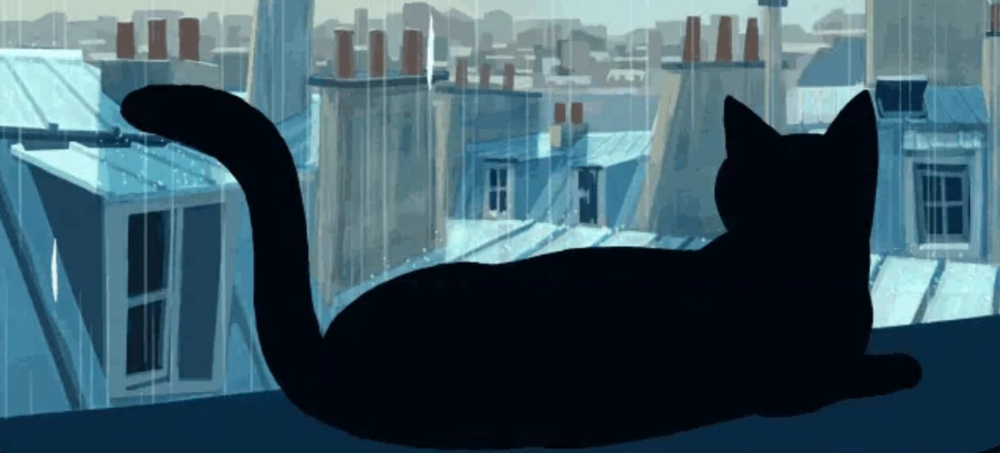

# Katrina's Coding Catalysts
*"Sparking Innovation, One Line of Code at a Time"*

  
## What's the Project?
This project is meant to prove I can build a GitHub repository that describes my team while also experimenting with Readme files and markdown techniques, challenging my retention on folder structure and adding others to collaborate! 

## Who's On the Team?
### Katrina MacAdams 
#### Nickname
Kat
 
#### Info
##### Born In
Sudbury ON, Canada
##### Fun Fact
I always have something pink on my person. You'll never see me without it
##### Hobbies
- Swimming
- Reading
- Ending World Hunger
- Writing

##### Furture Goals
1. Complete Interactive Media Design Program
2. Buy a Car
3. Complete Marketing Management Post-Grad Program
4. Internship?
5. Land a Super Awesome Gig in Digital Marketing
6. Win the Lottery

### TBD 
#### Nickname
TBD
 
#### Info
##### Born In
TBD
##### Fun Fact
TBD
##### Hobbies
TBD

##### Furture Goals
1. TBD
2. TBD
3. TBD
4. TBD
5. TBD
6. TBD

### Credits
Katrina MacAdams
TBD
 ### License 
 MIT